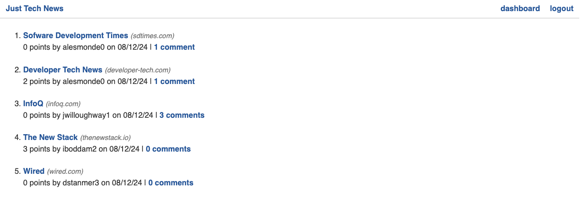

# Just Tech News
An app to help users discover new trends in the tech industry.  
Upon profile creation, users can create, comment and upvote on different posts.

# Table of Contents
* [User Story](#userstory)
* [Acceptance Criteria](#acceptancecriteria)
* [Live Site](#livesite)
* [Usage](#usage)
* [Technologies](#technologies)
* [Installation](#installation)
* [Contributors](#contributors)

## User Story
> AS someone interested in software engineering  
> I WANT to be able to discover and share trends in the tech industry  
> SO I can learn and discover new ways to build my knowledge, skills and portfolio.  

## Acceptance Criteria
> GIVEN the user is not a registered user  
> WHEN they arrive to the landing page  
> THEN they are prompted to login or signup.  
> GIVEN a registered user is logged in,  
> WHEN the user goes to their dashboard  
> THEN they are able to make a post   
> AND comment and upvote on others 

## Live Site
https://just-tech-newsfeed-f77d601f47c2.herokuapp.com/

## Usage

## Technologies
* Flask https://pypi.org/project/Flask/
* SQL Alchemy https://pypi.org/project/SQLAlchemy/
* Jinja https://jinja.palletsprojects.com/en/3.1.x/
* pip https://pypi.org/
* PyMySQL https://pypi.org/project/PyMySQL/
* Gunicorn https://pypi.org/project/gunicorn/
* Python  https://www.python.org/

## Installation
1. git clone https://github.com/hershrva/python-newsfeed.git
2. cd python-newsfeed
3. pip install -r requirements.txt
4. touch .env
5. Open the .env file and add the following line to configure your local database connection: DB_URL=mysql+pymysql://root:@localhost/python_news_db
6. python seeds.py
7. python -m flask run
